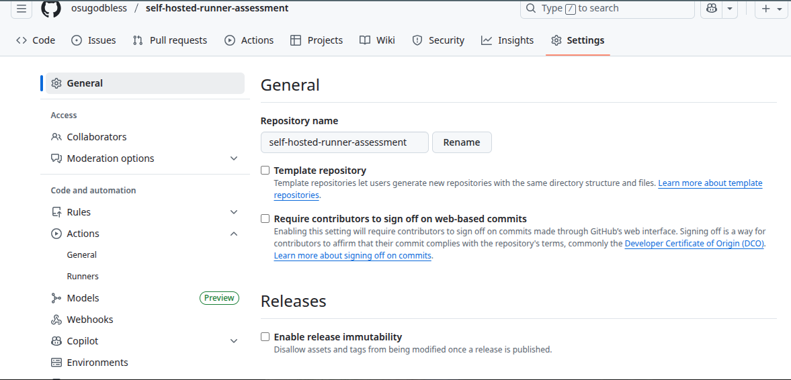
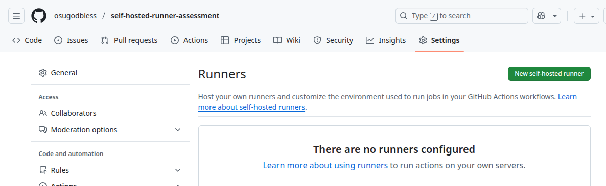
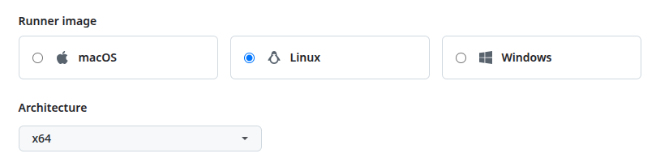
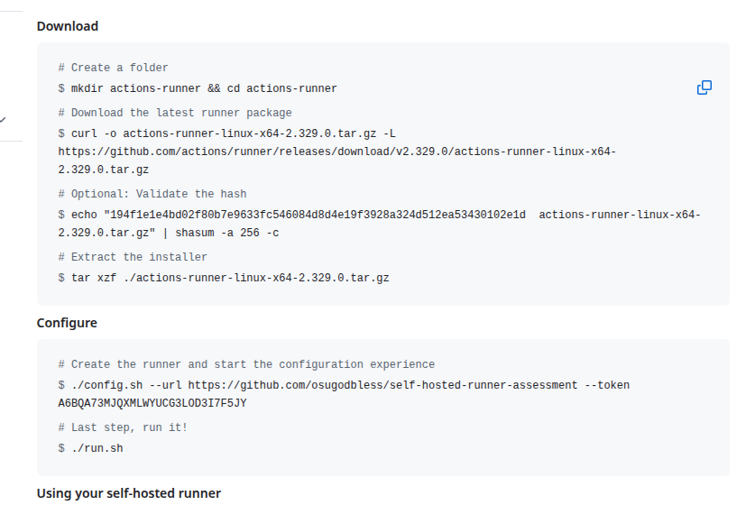
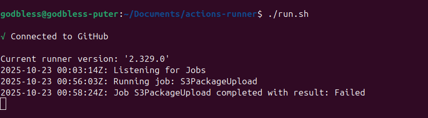

# Self-Hosted GitHub Actions Runner Assessment

A runner is basically a virtual machine used to run workflows. This virtual machine typically contains tools and packages that enables GitHub Actions to run smoothly. GitHub provides runners that are fully managed and operates on their infrastructure. When you use runners provided by GitHub (called GitHub-hosted runner), you have no control over its environment. However, there are some situation where having more control is required (e.g a hardware requirement not supported by GitHub-hosted runners). When faced with such scenarios that require customization of your runner environment, the solution is to set up a runner on your own infrastructure with all configurations that your workflow needs.

This kind of runner that you manage and operate yourself is known as a Self-hosted runner. It allows you to run jobs directly on your own preconfigured machine, instead of using GitHub-hosted runner. Below I have demonstrated how I set up a self-hosted GitHub Actions runner on my local computer, ran a test pipeline. I also outlined the challenges I faced, what I'd do differently in a production environment and some security considerations.

---

## How I set up my Self-hosted Runner

1. Created a new GitHub public repository that will be used to configure runner.

2. In the repository, I navigated to Settings → Actions → Runners → New self-hosted runner (as seen below) 
   

3. On the new page, to add a new self-hosted runner, I selected Linux as my runner image with a x64 architecture.

4. I got the configuration instruction (as seen in the image below)for the Linux runner image I selected and ran them on my PC using the terminal. 

By running the commands above, I successfully did the following:
   - Downloaded and extracted the self-hosted runner package to  `actions-runner` directory.
   - Configured and registered the runner to GitHub Actions using the repository URL and time-limited token. 
   - Connected my self-hosted runner application to GitHub Actions.

5. Went back to the Runners page to confirm that the runner has been registered on GitHub.

## Test Pipeline Using the Runner

To confirm that my GitHub Actions self-hosted runner is working and running workflows properly, I created a simple automation task. First, I cloned the remote repository to my local machine so I can easily use an IDE (vs code) to create, edit and manage the workflow files.

Next, I created a simple GitHub Actions workflow that runs on my self-hosted runner when triggered. The workflow contains a pipeline that authenticates to AWS using OIDC and syncs the content of the `images/` directory of this repository to an S3 bucket in AWS. 

Finally, I committed and pushed changes to the remote repository on GitHub and confirmed that the workflow used my self-hosted runner (as seen below).

---

## Challenges faced and how I solved them
A notable challenge I faced was the fact that I had only used GitHub Actions with GitHub-hosted runners. The way I tackled this challenge was to firstly read extensively about self-hosted runners so as to understand how they work and best practices when using them, before actually configuring any. Once I understood how it works, the actually configuration process did not pose any significant challenge.

---

## What I would do differently in a production environment

In a production environment I will implement the following;

- Run the runner in an isolated virtual machine on the cloud or on a dedicated server for on-premises.
- Configure GitHub Actions runner for organization instead of repository. This is so that all repositories inside the organization can use the configured GitHub Actions runner instead of configuring runners for individual repositories.
- Implement autoscaling and configure GitHub Actions runners to run in ephemeral mode. This is so that each job in the production workflow runs on a fresh isolated environment. It prevents any mistake of sensitive data leaks betweeen jobs and reduces the risk of a compromised runner receiving new jobs.
- Make sure a self-hosted runner has proper security controls
- Block public repositories access to self-hosted runner.
- Use short-lived credential where possible to enhance security of the production workflows. An example is using GitHub Actions OpenID Connect (OIDC).

---

## Security considerations
  Ideally self-hosted runners should only be hosted for private repositories and never for public repositories. I considered this during implementation. However I only went ahead to use a public repository because of assessment. With a private repository, there will be challenges with accessing the repository when one is not the owner nor have the required permission.